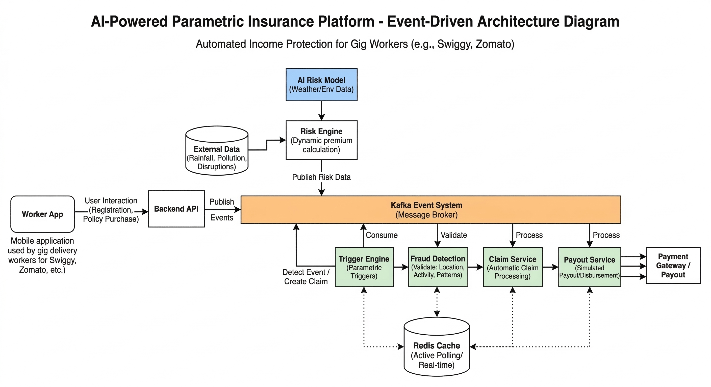

# Parametrix – AI Powered Parametric Insurance for Gig Workers

AI-powered parametric insurance platform that protects gig delivery workers from income loss caused by external disruptions such as extreme weather and environmental conditions.

---

## 🚀 Quick Start

### Prerequisites
- **Java 21** (Required - NOT compatible with Java 25)
- **Maven 3.9+**
- **Node.js 18+** (with npm)
- **Docker & Docker Compose** (for infrastructure)

> ⚠️ **CRITICAL:** You must use Java 21. Lombok 1.18.32 will fail with Java 25.
> See [services/BUILD.md](services/BUILD.md) for detailed setup instructions.

### Build Backend Services

**Quick Build (Using Script):**
```bash
cd services
./build.sh
```

**Manual Build:**
```bash
# Set Java 21
export JAVA_HOME=/Library/Java/JavaVirtualMachines/jdk-21.jdk/Contents/Home
export PATH=$JAVA_HOME/bin:$PATH

# Build all services
cd services
mvn clean install
```

For detailed build instructions, see [services/BUILD.md](services/BUILD.md)

### Run with Docker Compose (Recommended)

```bash
# Start all services (MongoDB, Redis, Kafka, Backend, Frontend)
docker-compose up -d

# View logs
docker-compose logs -f

# Stop all services
docker-compose down
```

**Access Points:**
- Frontend: http://localhost:3000
- API Gateway: http://localhost:8080
- Kafka UI: http://localhost:8090

### Run Locally (Development)

**1. Start Infrastructure**
```bash
docker-compose up -d mongodb redis zookeeper kafka
```

**2. Build & Run Backend**
```bash
# Ensure Java 21 is active
export JAVA_HOME=/Library/Java/JavaVirtualMachines/jdk-21.jdk/Contents/Home
export PATH=$JAVA_HOME/bin:$PATH

# Build common module first
cd services
mvn clean install -DskipTests

# Run services (each in a separate terminal)
cd api-gateway && mvn spring-boot:run
cd risk-engine && mvn spring-boot:run
cd trigger-engine && mvn spring-boot:run
cd fraud-detection && mvn spring-boot:run
cd claim-service && mvn spring-boot:run
cd payout-service && mvn spring-boot:run
```

**3. Run Frontend**
```bash
cd frontend
npm install
npm run dev
```

### Run Tests

```bash
# Backend tests (all 49 tests)
cd services
./build.sh  # Includes tests

# Or manually with Java 21
export JAVA_HOME=/Library/Java/JavaVirtualMachines/jdk-21.jdk/Contents/Home
cd services && mvn test

# Frontend tests
cd frontend && npm test
```

---

# Overview

Gig economy delivery workers rely on daily deliveries to earn income. Workers on platforms like Swiggy and Zomato are highly affected by external disruptions such as heavy rain, floods, extreme heat, or severe air pollution.

These disruptions reduce deliveries and can significantly impact their weekly earnings.

Currently, gig workers **do not have automated income protection systems** that compensate them for such disruptions.

Parametrix proposes an **AI-powered parametric insurance platform** that detects disruptions automatically and triggers payouts to affected workers.

---

# Problem Statement

Gig delivery workers depend on daily work availability. When disruptions occur:

- Heavy rainfall stops deliveries
- Severe pollution prevents outdoor work
- Flooded roads block delivery routes
- Extreme temperatures reduce working hours

These disruptions can reduce **20–30% of a worker's weekly income**, and currently workers bear the full financial loss.

Traditional insurance systems are not suitable because they require **manual claims and slow processing**.

---

# Proposed Solution

Parametrix introduces a **parametric insurance system** designed specifically for gig workers.

Instead of filing claims manually, the platform:

1. Monitors environmental conditions in real time  
2. Detects disruption events automatically  
3. Validates worker location and activity  
4. Processes claims automatically  
5. Sends compensation instantly

This creates a **zero-touch insurance system** for gig workers.

---

# Weekly Insurance Model

Workers subscribe to a **weekly micro-insurance policy** aligned with their earning cycle.

Example Policy:

- Weekly Premium: ₹20  
- Coverage Limit: ₹800  
- Policy Duration: 7 days  

Premiums are dynamically adjusted using an **AI risk scoring model** based on environmental risk in the worker’s location.

---

# Parametric Triggers

The system automatically monitors external data sources to detect disruption events.

Example triggers include:

- Heavy rainfall above threshold  
- Severe air pollution levels (AQI)  
- Flood alerts  
- Extreme temperature conditions  

When a disruption occurs, the system automatically triggers a claim.

---

# System Architecture

The platform uses an **event-driven architecture** built around Kafka and Redis.

Worker actions and environmental events are published to a **Kafka event streaming system**, enabling services to process events asynchronously.

Core services include:

- Risk Engine (AI-based premium calculation)
- Trigger Engine (detect disruption events)
- Fraud Detection Service
- Claim Processing Service
- Payout Service

Redis is used as a **real-time caching layer** for policy data, worker activity, and disruption monitoring.

---

# Architecture Diagram



---

# Core Components

### Worker App
Allows gig workers to register, purchase policies, and track coverage.

### Backend API
Handles user requests and publishes events to Kafka.

### Kafka Event System
Central message broker enabling event-driven communication between services.

### Risk Engine
Uses AI models to calculate disruption risk and determine weekly premium pricing.

### Trigger Engine
Detects environmental disruption events and initiates automatic claims.

### Fraud Detection
Validates worker location, activity patterns, and claim legitimacy.

### Claim Service
Handles automated claim processing.

### Payout Service
Simulates payout through a payment gateway.

### Redis Cache
Stores real-time policy data and disruption monitoring information.

---

# AI Components

### Risk Prediction Model

Uses environmental data such as:

- Rainfall history
- Air quality levels
- Seasonal weather patterns
- Location-based environmental risks

Output:

Risk score used to dynamically calculate weekly insurance premiums.

### Fraud Detection Model

Uses anomaly detection to identify suspicious claims such as:

- Location mismatch
- Duplicate claims
- Abnormal claim patterns

---

# Technology Stack

| Layer | Technology |
|-------|------------|
| Frontend | Next.js 14, Tailwind CSS, Framer Motion |
| Backend | Spring Boot 3.2, Java 21 |
| Event Streaming | Apache Kafka |
| Caching | Redis |
| Database | MongoDB |
| Build Tool | Maven 3.9+ |
| Dependency Management | Parent POM (centralized versions) |
| API Documentation | OpenAPI 3.0 |
| Containerization | Docker, Docker Compose |

### External API Integrations
- Weather Data: OpenWeatherMap API (stub mode for demo)
- Air Quality: WAQI API (stub mode for demo)
- Payments: Razorpay Sandbox (simulation)

---

# Microservices Architecture

```
┌─────────────────────────────────────────────────────────────────┐
│                     FRONTEND (Next.js :3000)                    │
│  Worker Dashboard │ Policy Purchase │ Claims │ Payout Tracking  │
└───────────────────────────┬─────────────────────────────────────┘
                            │ REST API
┌───────────────────────────▼─────────────────────────────────────┐
│                  API GATEWAY (:8080)                            │
│         Authentication │ Rate Limiting │ Request Routing        │
└───────────────────────────┬─────────────────────────────────────┘
                            │ Kafka Events
        ┌───────────────────┼───────────────────┐
        ▼                   ▼                   ▼
┌───────────────┐   ┌───────────────┐   ┌───────────────┐
│  RISK ENGINE  │   │TRIGGER ENGINE │   │FRAUD DETECTION│
│   (:8081)     │   │   (:8082)     │   │   (:8083)     │
└───────┬───────┘   └───────┬───────┘   └───────┬───────┘
        │                   │                   │
        └───────────────────┼───────────────────┘
                            ▼
                ┌───────────────────┐
                │  CLAIM SERVICE    │
                │    (:8084)        │
                └─────────┬─────────┘
                          ▼
                ┌───────────────────┐
                │  PAYOUT SERVICE   │
                │    (:8085)        │
                └───────────────────┘

┌─────────────────────────────────────────────────────────────────┐
│  MongoDB │ Redis │ Kafka │ Zookeeper                            │
└─────────────────────────────────────────────────────────────────┘
```

### Service Responsibilities

| Service | Port | Responsibility |
|---------|------|----------------|
| api-gateway | 8080 | REST API, JWT Auth, Worker management |
| risk-engine | 8081 | AI risk scoring, premium calculation |
| trigger-engine | 8082 | Weather/AQI monitoring, disruption detection |
| fraud-detection | 8083 | Claim validation, anomaly detection |
| claim-service | 8084 | Automated claim processing |
| payout-service | 8085 | Payment gateway integration |
| admin-simulator | 8091 | Weather simulation for demos (NEW) |

### Admin Dashboard (NEW)

| Route | Port | Description |
|-------|------|-------------|
| / | 3000 | Service health & statistics overview |
| /simulation | 3000 | Weather event simulator |
| /claims | 3000 | Claims management table |
| /policies | 3000 | Policy analytics |
| /workers | 3000 | Worker management |
| /events | 3000 | Real-time Kafka events |
| /logs | 3000 | System log aggregation |

### Admin Dashboard Backend Connectivity

The admin dashboard now runs fully connected to backend APIs via `admin-simulator` (default `:8091`) and no longer depends on UI mock data.

Set in `admin-dashboard/.env.local`:

```
NEXT_PUBLIC_API_URL=http://localhost:8091
NEXT_PUBLIC_SIMULATOR_URL=http://localhost:8091
```


### Kafka Topics

| Topic | Publisher | Consumers |
|-------|-----------|-----------|
| `parametrix.worker.registered` | API Gateway | Risk Engine |
| `parametrix.policy.purchased` | API Gateway | Risk Engine, Claim Service |
| `parametrix.environment.disruption` | Trigger Engine | Fraud Detection, Claim Service |
| `parametrix.claim.initiated` | Claim Service | Fraud Detection |
| `parametrix.claim.validated` | Fraud Detection | Claim Service |
| `parametrix.claim.approved` | Claim Service | Payout Service |
| `parametrix.payout.completed` | Payout Service | API Gateway |

---

# Development Roadmap

Phase 1 – Ideation and System Design  
Architecture design, AI modeling, and prototype.

Phase 2 – Automation and Protection  
Worker onboarding, policy management, dynamic premium calculation.

Phase 3 – Scale and Optimization  
Fraud detection, automated claims, instant payout simulation, analytics dashboards.

---

# Expected Impact

Parametrix provides gig workers with a **financial safety net during environmental disruptions**.

By combining **AI risk modeling, real-time event processing, and automated parametric insurance**, the platform enables scalable protection for India's rapidly growing gig economy.

---

## 📁 Project Structure

```
parametrix/
├── services/
│   ├── common/              # Shared models, DTOs, events
│   ├── api-gateway/         # REST API & Authentication
│   ├── risk-engine/         # AI Premium Calculation
│   ├── trigger-engine/      # Environmental Monitoring
│   ├── fraud-detection/     # Claim Validation
│   ├── claim-service/       # Claim Processing
│   ├── payout-service/      # Payment Integration
│   ├── admin-simulator/     # Weather Simulation (NEW)
│   └── build-multiarch.sh   # Multi-arch Docker builds
├── admin-dashboard/         # Next.js Admin Dashboard (NEW)
├── frontend/                # Next.js Worker Application
├── architecture/            # System design diagrams
├── docs/                    # Documentation
├── prototype/               # Original prototype specs
├── AI-README.md             # AI Model Context Documentation
└── docker-compose.yml       # Full stack orchestration
```

---

## 🔧 Configuration

### Environment Variables

**Backend Services:**
```
MONGODB_URI=mongodb://localhost:27017/parametrix
KAFKA_BOOTSTRAP_SERVERS=localhost:9092
REDIS_HOST=localhost
JWT_SECRET=your-secret-key
```

**Frontend:**
```
NEXT_PUBLIC_API_URL=http://localhost:8080
```

### API Keys (Optional)
For production, configure real API keys:
- `WEATHER_API_KEY` - OpenWeatherMap API key
- `AQI_API_KEY` - WAQI API token
- `RAZORPAY_KEY_ID` / `RAZORPAY_KEY_SECRET` - Payment gateway

---

## 📊 API Endpoints

### Authentication
- `POST /api/auth/register` - Worker registration
- `POST /api/auth/login` - Login
- `POST /api/auth/refresh` - Refresh token

### Workers
- `GET /api/workers/me` - Get current worker
- `PUT /api/workers/me` - Update profile

### Policies
- `POST /api/policies/purchase` - Purchase policy
- `GET /api/policies` - List policies
- `GET /api/policies/active` - Get active policy

### Claims
- `GET /api/claims` - List claims
- `GET /api/claims/{id}` - Get claim details

### Payouts
- `GET /api/payouts` - List payouts

---

## 🧪 Testing

All 49 tests pass across 7 microservices:
- Common: 19 tests (DateUtils, GeoUtils)
- API Gateway: 11 tests (WorkerService, AuthService)
- Risk Engine: 3 tests
- Trigger Engine: 6 tests
- Fraud Detection: 3 tests
- Claim Service: 3 tests
- Payout Service: 4 tests

### Backend Unit Tests
```bash
# Run all tests (requires Java 21)
cd services
./build.sh

# Or manually
export JAVA_HOME=/Library/Java/JavaVirtualMachines/jdk-21.jdk/Contents/Home
cd services && mvn test
```

### Frontend Tests
```bash
cd frontend
npm test              # Run tests
npm run test:watch    # Watch mode
npm run test:coverage # Coverage report
```

---

## ⚠️ Troubleshooting

### Error: "TypeTag :: UNKNOWN" or Lombok compilation errors
**Cause:** Using Java 25 instead of Java 21  
**Solution:** Set Java 21 as described in [services/BUILD.md](services/BUILD.md)

### Build fails with "Could not find artifact com.gigshield:gigshield-services:pom"
**Cause:** Parent POM not installed  
**Solution:** Run `mvn clean install` from services directory with Java 21

For more troubleshooting, see [services/BUILD.md](services/BUILD.md)

---

## 📝 License

MIT License - see LICENSE file for details.
